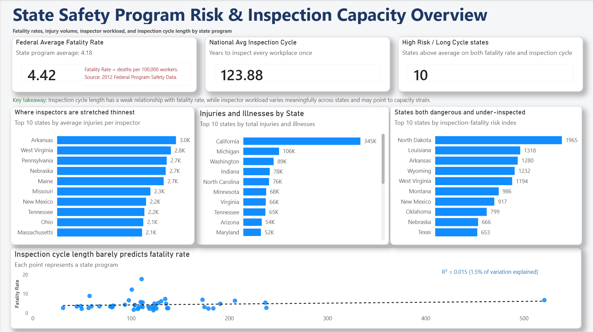
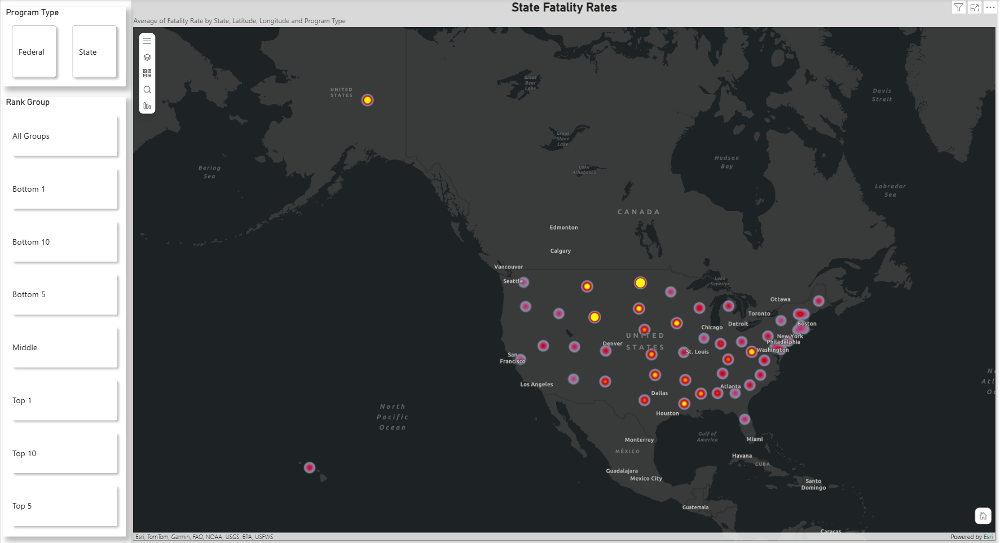

# OSHA Workplace Safety Analysis (2012)

Which states are the most dangerous to work in, and does inspecting workplaces more often actually make them safer? This project analyzes 2012 OSHA workplace safety data across all 50 states to find out, using SQL for the data work and Power BI for the dashboard.

## The headline finding

Inspection frequency barely explains fatality rates. Plotting each state's inspection cycle length against its worker fatality rate produces an R-squared of 0.015, meaning inspection timing accounts for roughly 1.5% of the variation in how often workers die on the job. The more useful signal is inspector workload: injuries and illnesses per inspector swing widely across states and point to where inspection capacity is stretched thin.

## What the dashboard shows

- **Federal vs. State program fatality rates.** Federal-program states average 4.42 deaths per 100,000 workers against 4.18 for State-program states.
- **Injury and illness volume by state.** California leads with roughly 345,000 recorded injuries and illnesses.
- **Inspector workload.** Top-10 states by injuries and illnesses per inspector, surfacing where coverage is thinnest (Arkansas, West Virginia, and Pennsylvania lead).
- **Risk vs. inspection capacity.** A risk index combining fatality rate and inspection cycle length flags 10 states that are both higher-risk and under-inspected, led by South Dakota, Louisiana, and Arkansas.
- **Geographic view.** A state-level map of worker fatality rates, sized by deaths per 100,000 workers rather than raw death count, with a Federal/State program filter.

## Interactivity

The geographic page includes a Program Type filter (Federal vs. State) and a rank selector built on a disconnected parameter table with a RANKX-based measure, so the view can be narrowed to the top or bottom N states by fatality rate.

## Engineered metrics

The dashboard and the SQL share the same calculated fields, built from the cleaned data:

- **Injuries per Inspector** — injuries and illnesses divided by inspectors, the inspector-workload measure
- **Inspection-Fatality Risk Index** — inspection cycle length multiplied by fatality rate, to rank states by combined risk and under-inspection
- **High Risk / Long Cycle flag** — marks the 10 states above average on both fatality rate and inspection cycle length
- **Inspection Coverage Score** — one divided by years to inspect each workplace once
- **Fatalities per 100,000 Injuries/Illnesses**, plus fatality-rate and inspection-cycle differences from the national average

## How fatality rate is defined

Fatality Rate = worker deaths per 100,000 workers. This is a rate, not a raw count, so a small state with few deaths can still post a high rate. North Dakota carries the highest rate in the dataset while California, with far more total deaths, sits lower because of its much larger workforce.

## Data preparation

The raw file lands as 54 rows with every value stored as text and each state's name packed into one cell with its latitude and longitude. The cleaning pipeline separates the state name from the coordinates, converts blanks to true nulls so missing values are never counted as zero, casts the numbers, and filters out the national-total and footnote rows to leave exactly the 50 states. The same preparation is used across the SQL, Excel, and Power BI versions.

## Tools

- **SQL** (SQLite / DB Browser) for cleaning, engineering metrics, and aggregating the data
- **Power BI** for the data model, DAX measures, and the dashboard
- **Excel** as the original source data and first build

## Repository contents

- `workplace_safety_analysis.sql` — full SQL analysis: data cleaning, engineered metrics, and the five business questions
- `dashboard-overview.png` — Overview page (KPIs, inspector workload, risk index, inspection-vs-fatality scatter)
- `dashboard-map.png` — Geographic page (state-level fatality rates with Program Type and rank filters)

## Data source

2012 federal and state workplace safety program data (OSHA).
